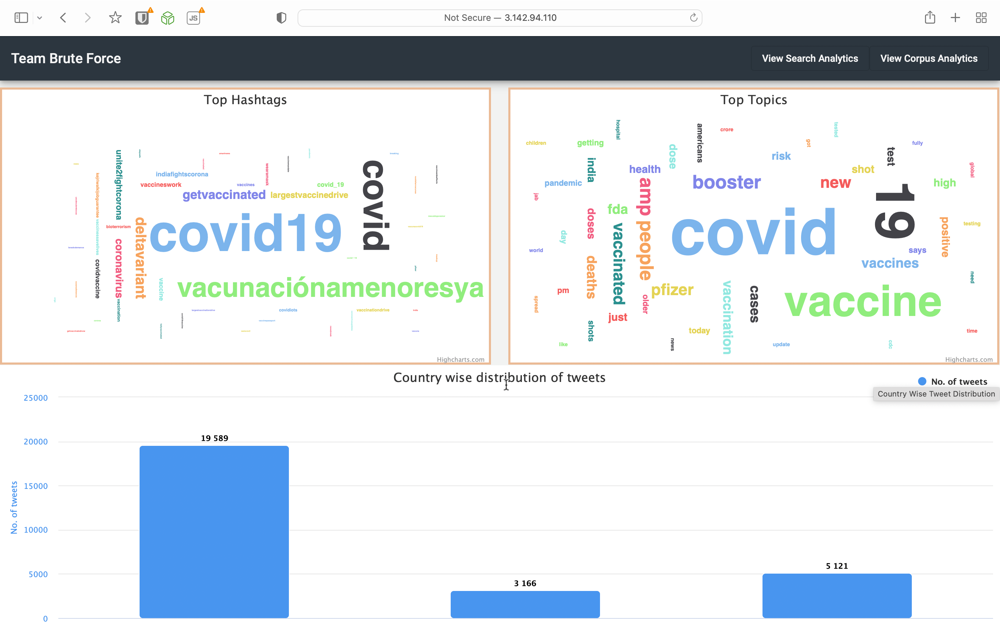
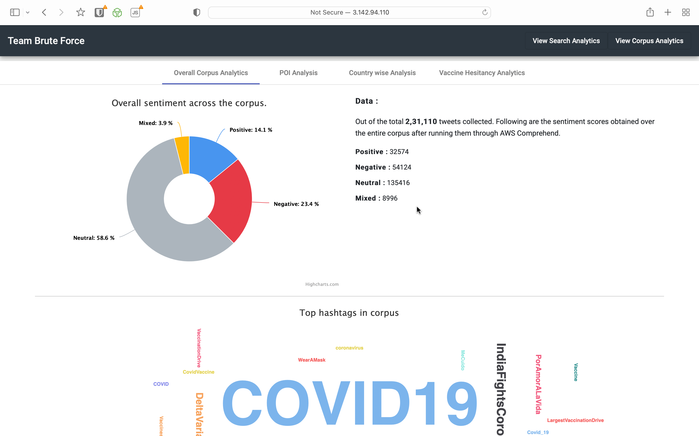
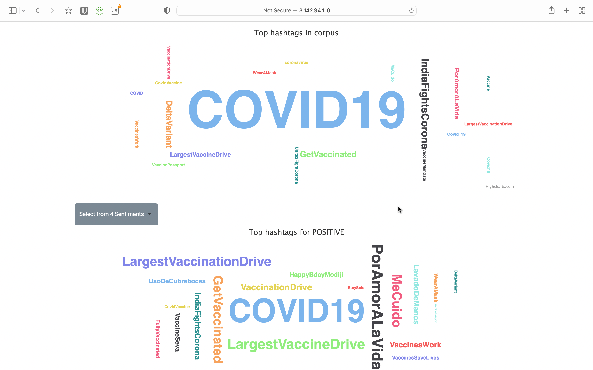
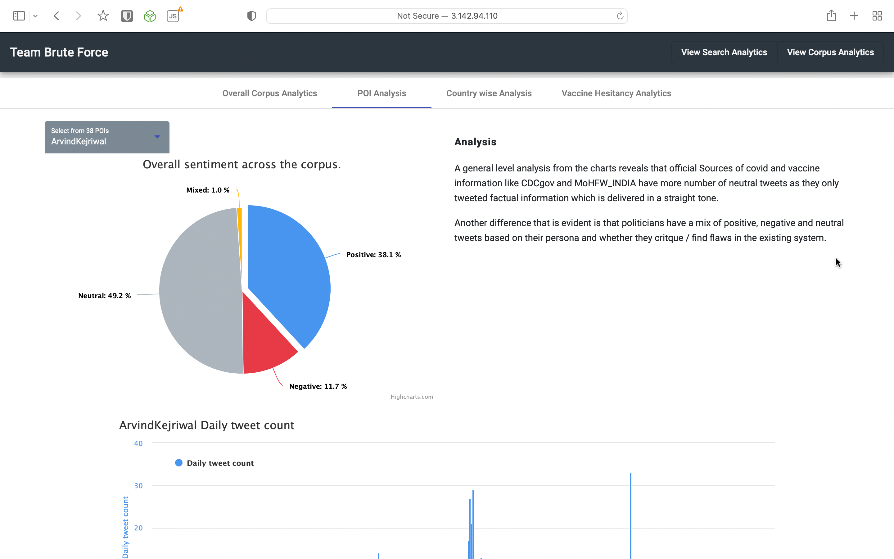
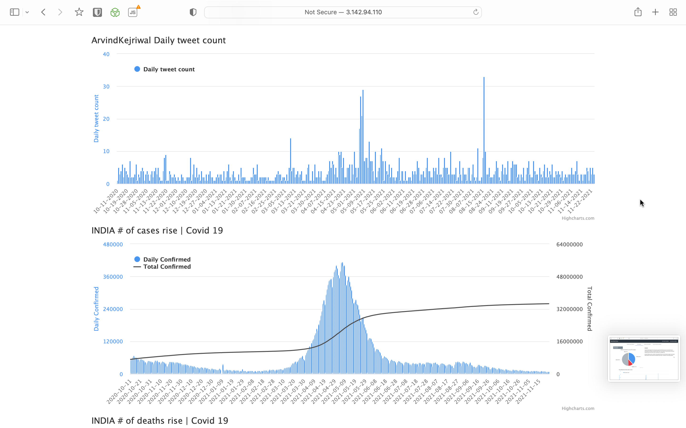
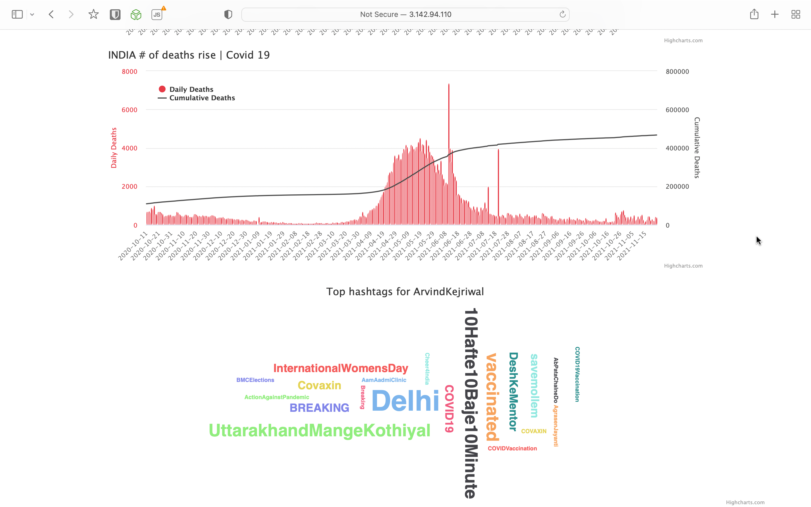
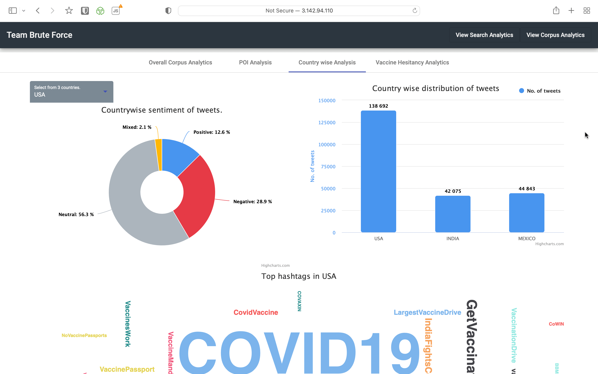

# Covid 19 Vaccine Rhetoric Analysis Based on Tweets scraped from Twitter.

## Screenshots of Live Project:

## Installation
---

1. Run Backend Server in the `Backend` Folder.
2. Run Frontend Server in the `Frontend` Folder. 
3. Ensure Solr Server has the tweets data and is setup correctly with variable names in `variables.py`
4. Ensure MongoDB has the tweets data in the DB and the URL is setup correctly in `variables.py`

* To check indepth project details : [Project Report](IR%20Project%204_up.pdf)

**NOTE:** As the tweets data files sizes are large they have been removed due to insufficient space. 
